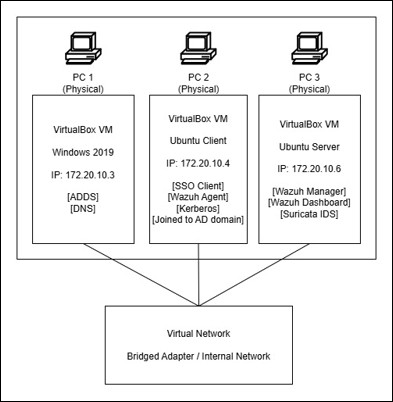
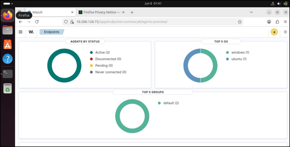
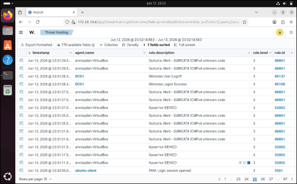
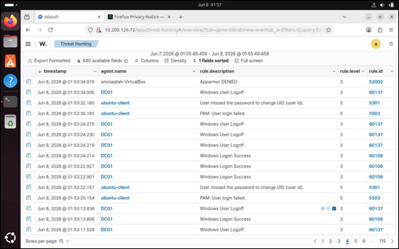

# 🛡️ Hybrid SSO and Centralized Security Monitoring with Wazuh SIEM

A group project developed for the **Network Security Infrastructure and Design** course at Universiti Teknikal Malaysia Melaka (UTeM). This project demonstrates cross-platform Single Sign-On (SSO) between Windows and Linux environments while implementing centralized security monitoring using Wazuh SIEM and Suricata IDS.

---

## 📖 Project Overview

Modern organizations often operate in hybrid environments consisting of Windows and Linux systems. Managing authentication and monitoring security events across multiple operating systems can be challenging.

This project integrates **Windows Active Directory**, **Ubuntu Linux**, **Kerberos**, **SSSD**, **Wazuh SIEM**, and **Suricata IDS** to create a centralized authentication and security monitoring solution.

The system enables Linux users to authenticate using Active Directory accounts while continuously monitoring authentication activities, privilege escalation attempts, and suspicious network behaviour from a centralized Wazuh dashboard.

---

## 🎯 Project Objectives

- Implement Active Directory Domain Services (AD DS)
- Configure cross-platform Single Sign-On (SSO)
- Integrate Ubuntu with Windows Active Directory
- Deploy Wazuh SIEM for centralized monitoring
- Collect logs from Windows and Linux systems
- Detect authentication failures and brute-force attacks
- Monitor privilege escalation activities
- Detect suspicious network traffic using Suricata IDS

---

## 🏗️ System Architecture

---

## 🛠️ Technologies Used

| Category | Technologies |
|----------|--------------|
| Operating Systems | Windows Server 2019, Ubuntu Server, Ubuntu Desktop |
| Identity Management | Active Directory Domain Services (AD DS) |
| Authentication | Kerberos, SSSD |
| SIEM | Wazuh Manager, Wazuh Agent |
| Network Security | Suricata IDS |
| Virtualization | Oracle VM VirtualBox |
| Testing Tool | Nmap |

---

## ⚙️ System Workflow

1. Configure Windows Server as the Active Directory Domain Controller.
2. Join Ubuntu Linux to the Active Directory domain using Kerberos and SSSD.
3. Install and configure Wazuh Manager.
4. Deploy Wazuh Agents on monitored systems.
5. Install and configure Suricata IDS.
6. Collect authentication and system logs.
7. Analyse security events through the Wazuh Dashboard.
8. Validate security monitoring using attack simulation and detection testing.

---

## 👩‍💻 My Contribution

This project was completed as a **group assignment**.

My primary responsibilities focused on the implementation of **Wazuh SIEM**, including:

- Installing and configuring Wazuh Manager
- Deploying Wazuh Agents
- Monitoring authentication logs
- Analysing security alerts
- Validating brute-force attack detection
- Monitoring privilege escalation events
- Verifying Nmap scan detection
- Testing security monitoring functionality

---

## 📸 System Demonstration

### Wazuh Dashboard

---

### Log Collection

---

### Suricata Alert Detection

---

### Security Alerts

---

## 🧪 Testing Results

The implemented security monitoring solution was validated through several security test scenarios.

| Test Scenario | Result |
|--------------|--------|
| Valid Linux Active Directory Login | ✅ PASS |
| Invalid Password Login Detection | ✅ PASS |
| Brute Force Attack Detection | ✅ PASS |
| Privilege Escalation Detection | ✅ PASS |
| Nmap Scan Detection | ✅ PASS |

These test cases demonstrate that the centralized monitoring platform successfully detected and recorded important security events from both Windows and Linux environments.

---

## 📚 Skills Demonstrated

- Active Directory Administration
- Linux Administration
- Windows Server Administration
- Wazuh SIEM Deployment
- Security Information and Event Management (SIEM)
- Log Collection and Analysis
- Kerberos Authentication
- Cross-platform Identity Management
- Intrusion Detection System (IDS)
- Security Monitoring
- Network Security
- Virtualization using Oracle VM VirtualBox

---

## 📖 What I Learned

Throughout this project, I gained practical experience in:

- Deploying enterprise security monitoring solutions
- Integrating Linux with Windows Active Directory
- Configuring Kerberos authentication
- Analysing authentication and security logs
- Detecting suspicious activities using SIEM
- Working with Wazuh and Suricata
- Performing security validation using attack simulations
- Troubleshooting cross-platform authentication issues

---

## ⚠️ Disclaimer

This repository is intended for **educational and portfolio purposes only**.

The project was completed as a university group assignment. This repository highlights **my individual contribution**, which primarily focused on the implementation and validation of **Wazuh SIEM**. Any sensitive information, credentials, IP addresses, or institutional details have been removed before publication.

---

## 👩‍💻 Author

**Amni Aqilah**

Bachelor of Computer Science (Computer Security) with Honours

📧 **Email:** amniaqilah24@gmail.com

💼 **LinkedIn:** https://www.linkedin.com/in/amni-aqilah-b94283371/
